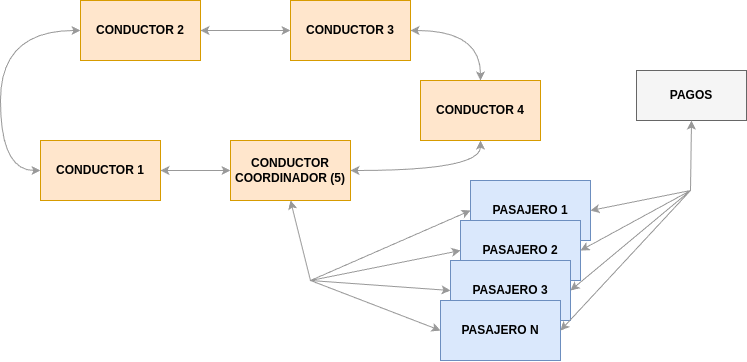
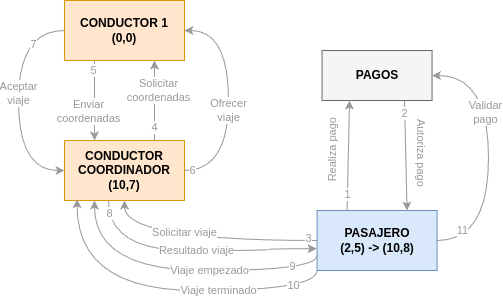
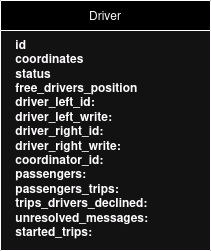
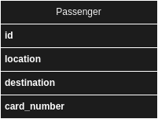

# Trabajo práctico N.º 2 - ConcuRide
## Equipo: Ferris fiubense
### Integrantes:

| Apellido  | Nombre | Padrón | Mail                 |
|-----------|--------|--------|----------------------|

## Decisiones de diseño

Partimos de los siguientes supuestos:
  - Los viajes se identifican con el id del pasajero solicitante, por lo que pueden tener un solo viaje en curso
  - Los conductores se encuentran en un punto fijo, esperando viajes
  - Los conductores envían su ubicación solo cuando el conductor coordinador se los solicita
  - Los conductores que no respondan con sus coordenadas cuando se lo solicite, se los asume como ocupados
  - Cualquier punto dentro del plano que representa al mapa tendrá coordenadas $(x, y)$ donde $x$ e $y$ están en el intervalo $[−255,255]$


### Cambios en el diseño inicial

Con respecto a lo pensado inicialmente, realizamos varios cambios
- Reemplazamos lo que pensamos como "Aplicación" y "procesos" como una única entidad "Conductor coordinador", esto para simplificar el sistema en cuanto a cantidad de actores
- Intentamos realizar un algoritmo bully para la elección de líder, pero en la implementación nos fue más sencillo realizar un algoritmo de "ring" en donde se conectan todos los conductores entre sí para formar un anillo
- La comunicación al gateway de pagos se la dejamos al pasajero, esto para asegurarnos de que los viajes que recibamos ya hayan sido autorizados
- Consideramos más simple que el gateway de pagos use el protocolo TCP, ya que estábamos más familiarizados con el mismo. También ahora asumimos que no puede caerse.
- No consideramos tan importante simular que los conductores se encuentran cambiando de punto dependiendo del tiempo, por lo que los conductores se encuentran estáticos a la espera de viajes
- Agrandamos los límites del plano para que su rango coincida con el de un byte

### Arquitectura general

El sistema cuenta con varios conductores conectados entre sí y varios pasajeros que se conectan a un solo conductor, que denominaremos conductor coordinador.



Cada conductor y pasajero se van a ejecutar como procesos independientes, cada uno siendo un actor.

El pasajero valida su pago comunicándose con el sistema de pagos, y en caso de ser validado el mismo, enviará su solicitud de viaje.

Habrá un conductor coordinador que será el encargado de gestionar la comunicación entre todos los demás actores. Le llegarán solicitudes de viaje desde un pasajero, le asignará a este un conductor para que lo tome, luego recibirá si ese conductor lo aceptó, en caso contrario se enviará a otro hasta que se acepte por alguno o se rechace por todos. Cuando un conductor lo acepta, este procede a realizar el viaje y vuelve a disponibilizarse una vez que se complete el mismo. Gestionando así todo el flujo entre actores. 

## Diagrama de threads y procesos

Posible flujo inicial entre procesos.



## Diagrama de entidades

### Entidad: conductor

Run:
```
cargo run <id> <x_position> <y_position>
```

Este actor representa a los conductores que se encuentran conectados al sistema.

El conductor coordinador será quien reciba inicialmente los pedidos desde un pasajero, y luego según corresponda empezará con el flujo de comunicación con los demás conductores para las distintas necesidades (pedir información de su posición, ofrecer viaje, etc.), cada conductor siempre enviará mensajes hacia su derecha, ya sea solo propagando información recibida que no sea para él, o bien agregando información al mensaje o generando una respuesta.

Como es necesario mantener un canal para envío y recibo de mensajes, decidimos que lo más conveniente es usar el protocolo de transporte TCP.



Al recibir el mensaje:
  - `CoordinatesRequest <passenger_id>`: Envia el mensaje `CoordinatesResponse <drivers_coordinates> <passenger_id>` con sus coordenadas actuales
  - `ConnectRes <was_accepted> <leader_id>`: Si la conexión es exitosa, no hace nada. En caso de falla, verificará qué es lo que salió mal y, dependiendo de la falla, volverá a intentar la conexión o fallar en la inicialización del mismo
  - `HandleOffer <offer>`: Tomará una decisión (modelada al azar) sobre si toma el viaje o no, y envía un mensaje `TripResponse <status> <reason> <passenger_id> <driver_id>` indicando si lo tomó.
  - `NewCoordinator <id>`: Inicializa varias instancias internas si es el nuevo coordinador, y si no solo se limita a propagar el mensaje

Envia los demás mensajes cuando:
  - `Connect <mode>`: Se inicializa el actor.
  - `Disconnect`: Se desconecta.

En caso de que se caiga un conductor inesperadamente, tenemos que tener en cuenta si aceptó un viaje o no. Si no tiene un viaje aceptado, será como si no existiese y no cambia nada.
Si tuviese un viaje aceptado, se guardará ese id de conductor y el id del pasajero que se encuentra viajando, y cuando se reconecte se chequeará si está guardado y se finalizará el viaje en caso afirmativo.

Si se cae el conductor coordinador, cualquiera de los conductores dispara un proceso de elección de coordinador nuevo, que resultará en un mensaje `NewCoordinator <id>` con el id del nuevo conductor elegido.

### Entidad: Conductor coordinador

Es una extensión de la entidad "conductor", pero se encargará de recibir las solicitudes de viaje y distribuírsela a los otros conductores disponibles.

Al recibir el mensaje `TripRequest <coordinates_start> <coordinates_end>`: Envia una solicitud de autorización al gateway de pagos. Si el pago es rechazado, envia un `TripResponse <status> <reason> <passenger_id> <driver_id>` con motivo de rechazo. Si se aprueba el pago, se envia una `CoordinatesRequest <passenger_id>` y se espera a que los conductores las envien. Luego de eso, se procesan estos mensajes para ver cuáles conductores se encuentran cercanos y se le oferta el viaje al más cercano. En caso de rechazo o no respuesta de este conductor, se repite el flujo, enviando nuevamente `CoordinatesRequest <passenger_id>`.

En caso de caerse inesperadamente, se reorganizarán los demás conductores para elegir un nuevo coordinador según el mayor id y mantener la conexión en forma de anillo.

### Entidad: pasajero

Run:
```
cargo run
```



Este actor tiene el objetivo de simular a los pasajeros, solicitando un viaje con coordenadas de inicio y de fin. Cuando realiza la solicitud, puede ser aceptada o rechazada. El rechazo puede tener varios motivos, como que no hay conductores disponibles, ningún conductor aceptó la solicitud, o bien porque el pago fue rechazado. En caso de que se rechace su solicitud de viaje, queda a criterio del pasajero decidir si quiere volver a solicitarlo o desconectarse del conductor coordinador (decisión que se toma aleatoriamente).

Antes de solicitar un viaje, se enviará un pedido de validación de pagos a la aplicación Pagos, que si es aceptado habilitará a solicitar el viaje al conductor. Luego de recibido el viaje finalizado, se enviará un mensaje hacia Pagos para efectivizar el cobro. 

De igual manera con los conductores, necesitamos un canal de envío y recibo de mensajes, por lo que también decidimos usar el protocolo de transporte TCP.

Al recibir el mensaje:
  - `ConnectRes <was_accepted> <leader_id>`: Si la conexión es exitosa, seguirá con el flujo normal. En caso de falla, verificará qué es lo que salió mal y, dependiendo de la falla, volverá a intentar la conexión o fallar en la inicialización del mismo
  - `TripResponse <status> <reason> <passenger_id> <driver_id>`: Si es positivo, esperará hasta finalizado el viaje. Si es rechazado, tomará una decisión al azar si volver a solicitar el viaje o cerrar el conductor coordinador.

Envia mensajes cuando:
  - `Connect <mode>`: Se inicializa el actor.
  - `TripRequest <coordinates_start> <coordinates_end>`: Desea solicitar un viaje.
  - `Disconnect`: Se cierra el actor.

En caso de caída solo nos importa si tenía un viaje en curso. En ese caso, al resumir su sesión, el conductor coordinador le indica que tiene un viaje en curso, y no podrá solicitar otro hasta finalizarlo. Para eso debe enviar un mensaje `TripEnded <passenger_id>` para pasar a la efectivización del pago autorizado y asi dejándolo disponible para solicitar otro viaje.

### Pagos

Run:
```
cargo run
```

Esta entidad será un proceso que se supone siempre estará disponible. Esta se limitará a tomar decisiones sobre si un pago es aprobado o no. En este caso decidimos rechazar los pagos de tarjetas cuyo número sea par.

Para cada mensaje que se le envia, se inicia una conexión TCP.

Al recibir el mensaje `ValidatePayment <passenger_id> <card_number>`: Toma una decisión sobre si aprueba el pago o no, dependiendo el número de tarjeta y envia el mensaje `ValidatePaymentResponse <was_accepted>` con el resultado.

### Algunos Mensajes

| Mensaje                                                           | Origen                | Destino               | Descripción                                                                                                                                                      |
|-------------------------------------------------------------------|-----------------------|-----------------------|------------------------------------------------------------------------------------------------------------------------------------------------------------------|
| `Connect <mode>`                                                  | PASAJERO/CONDUCTOR    | CONDUCTOR COORDINADOR | Se solicita conexión al conductor coordinador, informando con el parámetro `<mode>` si el que se conecta es un pasajero o un conductor                           |
| `ConnectRes <was_accepted> <leader_id>`                           | CONDUCTOR COORDINADOR | PASAJERO              | Responde al mensaje de `Connect`, indicando si la conexión fue exitosa.                                                                                          |
| `TripRequest <coordinates_start> <coordinates_end>`               | PASAJERO              | CONDUCTOR COORDINADOR | El pasajero solicita un viaje desde `<coordenadas_start>` hasta `<coordenadas_end>`                                                                              |
| `ValidatePayment <passenger_id> <card_number>`                    | PASAJERO              | PAGOS                 | Se solicita la validación de un pago para el pasajero `<passenger_id>` y el `<card_number>` del mismo                                                            |
| `TripStarted`                                                     | PASAJERO              | CONDUCTOR COORDINADOR | Se informa que el viaje aprobado comienza                                                                                                                        |
| `TripEnded <passenger_id>`                                        | PASAJERO              | CONDUCTOR COORDINADOR | Se informa que el viaje en curso termina                                                                                                                         |
| `ValidatePaymentResponse <was_accepted>`                          | PAGOS                 | PASAJERO              | El sistema de pagos responde si el pago con fue exitoso, indicando el resultado en el campo `<was_accepted>`                                                     |
| `CoordinatesRequest <passenger_id>`                               | CONDUCTOR             | CONDUCTOR             | Se solicita a los conductores libres que informen sus coordenadas actuales para el viaje solicitado por `<passenger_id>`                                         |
| `CoordinatesResponse <drivers_coordinates> <passenger_id>`        | CONDUCTOR             | CONDUCTOR             | El conductor agrega sus coordenadas actuales a `<drivers_coordinates>` si está disponible para realizar el viaje de `<passenger_id>`                             |
| `OfferToDriver <driver_id> <origin> <destination> <passenger_id>` | CONDUCTOR             | CONDUCTOR             | Le ofrece el viaje de `<passenger_id>` al driver `<driver_id>`                                                                                                   |
| `HandleOffer <offer>`                                             | CONDUCTOR             | CONDUCTOR             | Decide que hacer con la `<offer>` recibida                                                                                                                       |
| `TripResponse <status> <reason> <passenger_id> <driver_id>`       | CONDUCTOR             | CONDUCTOR             | El conductor `<driver_id>` indica en el campo `<status>` si toma la oferta o no para el viaje de `<passenger_id>`, en caso de rechazo indica la razón `<reason>` |
| `SendToPassenger <msg> <passenger_id>`                            | CONDUCTOR COORDINADOR | PASAJERO              | El conductor le envía el mensaje `<msg>` al pasajero `<passenger_id>`                                                                                            |
| `ConnectToRight`                                                  | Self CONDUCTOR        | Self CONDUCTOR        | El conductor se trata de conectar a un conductor de su derecha según corresponda por id.                                                                         |
| `Disconnect`                                                      | CONDUCTOR             | CONDUCTOR             | Se desconecta del conductor a su izquierda para dar lugar a una nueva conexión con otro conductor.                                                               |
| `NewCoordinator <id>`                                             | CONDUCTOR             | CONDUCTOR             | Actualiza su coordinator_id con el nuevo `<id>` y propaga el mensaje si no es él el nuevo coordinador.                                                           |
